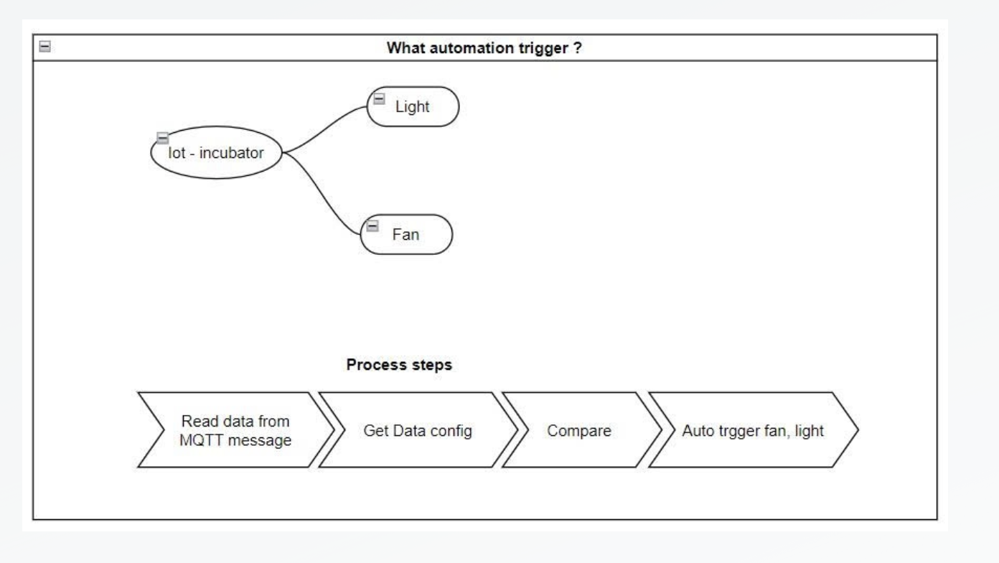

# Incubator IoT System 

 ## IoT System Overview

This project is an IoT-based Chicken Egg Incubator Monitoring System that leverages Raspberry Pi and AWS cloud services to provide a comprehensive solution for monitoring and controlling the incubation environment.

## Key Components and Workflow

1. **IoT Device (Raspberry Pi)**: 
   - The Raspberry Pi is equipped with a DHT11 sensor, which measures the temperature and humidity inside the incubator.
   - The sensor data is then published to AWS IoT Core.

2. **AWS IoT Core**:
   - AWS IoT Core serves as the central hub for collecting sensor data from the Raspberry Pi.
   - It securely processes the incoming data and triggers actions based on predefined rules.

3. **Data Storage (DynamoDB)**:
   - Sensor data received by AWS IoT Core is stored in DynamoDB, a NoSQL database that offers fast and flexible data retrieval.

4. **AWS Lambda**:
   - AWS Lambda functions are used to automatically process the incoming data from AWS IoT Core and store it in DynamoDB.
   - Lambda functions can also trigger automated actions based on the sensor readings, such as turning on a fan or adjusting a heating element.

5. **Subscriber for Automated Actions**:
   - The system includes a subscriber that listens to updates from the DHT11 sensor via AWS IoT Core. 
   - It automatically triggers actions such as controlling the temperature and humidity inside the incubator, ensuring an optimal environment for the eggs.

6. **Next.js Dashboard**:
   - A monitoring dashboard is built using Next.js to visualize the real-time data.
   - The dashboard allows users to monitor the incubator environment, watch live video feeds, and manually control the incubator's components.

This integrated solution provides a reliable and scalable approach to managing and monitoring egg incubation, ensuring that environmental conditions are maintained within optimal ranges automatically and with minimal human intervention.

## Demo

This Next Js dashboard is deployed on Render. You can access the live demo [here](https://incubator-monitoring.locatptn.site/).

The image is a screenshot of a Chicken Egg Incubator IoT Monitoring Dashboard. It displays real-time data and controls for managing the incubator environment. Key sections of the dashboard include:

1. **Video Streaming**: A live video feed showing the incubator's interior.
2. **Current Humidity**: A gauge showing the humidity level at 59.6%.
3. **Current Temperature**: A gauge showing the temperature at 37.4°C.
4. **Manual Actions**: Toggles for controlling the temperature light, a fan, and a motor, all of which are switched on.
5. **Temperature Time Series**: A real-time graph showing the temperature data from a DHT11 sensor, updating every 2 seconds. 

The dashboard is part of a local web server interface (running on `localhost:7979`) designed to monitor and control the incubator environment effectively.

The dashboard is part of a local web server interface (running on localhost:7979) designed to monitor and control the incubator environment effectively.

## Design and Implementation

### Hardware Components

This image consists of two sections depicting the hardware setup and wiring diagram for an IoT-based Chicken Egg Incubator system.

### Schematic Diagram
- The top section presents a detailed schematic diagram of the wiring connections for the Raspberry Pi, sensors, relays, and other components.
- **Raspberry Pi GPIO Pins**: It highlights the GPIO pins of the Raspberry Pi, which are connected to various components like buttons, sensors, and relays.
- **Relay Modules**: The schematic shows connections to a relay module with four relays (RL1, RL2, RL3, RL4), each connected to different devices like heating lamps or fans.
- **Buttons**: Several buttons (BTN1, BTN2, BTN3, BTN4) are connected to the GPIO pins, allowing manual control over the incubator's functions.
- **Power Supply**: The diagram includes connections for a 12V power supply to power the relay coils.

### Physical Wiring Layout
- The bottom section illustrates the physical wiring and components layout for the incubator system.
- **Raspberry Pi**: A Raspberry Pi board is shown as the central controller, interfacing with other components.
- **DHT11 Sensor**: The DHT11 sensor is depicted as connected to the Raspberry Pi for measuring temperature and humidity.
- **Relay Module**: A relay module with four relays is wired to control devices such as fans, a heating lamp, and other components in the incubator.
- **Fans**: Two fans are shown, likely used for regulating airflow and maintaining uniform temperature inside the incubator.
- **Heating Lamp**: A heating lamp is shown as part of the system to provide the necessary warmth for the incubation process.
- **Egg Tray**: An egg tray is depicted, where the eggs would be placed for incubation, with the heating lamp positioned above it.
- **Wiring**: Various wires connect these components, indicating the physical connections that correspond to the schematic diagram above.

This image represents both the theoretical (schematic) and practical (physical) setup of the incubator system, providing a comprehensive view of the hardware involved in this IoT project.

## Incubator Software Designs

The software design for the Incubator IoT System focuses on the integration of hardware components with cloud services to monitor and control the incubation environment efficiently. The system utilizes a combination of local processing on the Raspberry Pi and cloud-based processing through AWS IoT Core.

## Software Components

### 1. High-Level Architecture

The High-Level Design for the Incubator IoT System focuses on key principles to ensure that the system is secure, scalable, independent, and decoupled. These principles guide the overall architecture and the choices made in both the software and hardware design.

[High-Level Design Reference](https://shorturl.at/ePjR1)

### 2. Algorithm Design

The following table outlines the automatic triggering algorithm for maintaining optimal temperature and humidity levels during the incubation process. The algorithm adjusts the environmental conditions based on the day of the incubation period.

#### Temperature Settings

| Days                | Temperature      |
|---------------------|------------------|
| From 1-7 of days    | 37.8°C           |
| From 8-18 of days   | 37.6°C           |
| From 19-21 of days  | 37.2°C           |

#### Humidity Settings

| Days                | Humidity         |
|---------------------|------------------|
| From 1-5 of days    | 60-61% = 60.5%   |
| From 6-11 of days   | 55-57% = 56%     |
| From 12-18 of days  | 50-53% = 51.5%   |
| From 19 of days     | 60%              |
| From 20-21 of days  | 70-75%           |

This algorithm ensures that the incubator maintains the optimal environment for egg incubation, adjusting the temperature and humidity levels at critical stages in the incubation cycle.

### 3. Database Design
#### Incubator Database Structure

The following describes the database structure for the Incubator IoT System, which stores sensor data, incubator settings, and other relevant information in a DynamoDB database.

##### 1. Sensor Data Table (dht11_01)

This table logs the temperature and humidity readings from the DHT11 sensor, along with a timestamp. The structure is as follows:

| Field Name     | Data Type   | Description                                                   |
|----------------|-------------|---------------------------------------------------------------|
| `timestamp`    | String      | The timestamp when the sensor data was recorded               |
| `payload`      | JSON Object | Contains temperature and humidity readings along with an ID   |

##### 2. Incubator Settings Table (incubator_setting)

This table stores the predefined settings for the incubator, including the temperature and humidity levels for different days of the incubation process. The structure is as follows:

| Field Name     | Data Type   | Description                                                   |
|----------------|-------------|---------------------------------------------------------------|
| `day`          | String      | The day of the incubation process                              |
| `humid`        | Number      | The humidity level for the given day                           |
| `temp`         | Number      | The temperature level for the given day                        |
| `to_humid`     | Number      | The target humidity level for the given day                    |

##### 3. Incubator Information Table (incubator_code)

This table stores information about different incubators, including the incubator code and the start day of the incubation process. The structure is as follows:

| Field Name        | Data Type   | Description                                                     |
|-------------------|-------------|-----------------------------------------------------------------|
| `incubator_code`  | String      | The unique identifier for each incubator                        |
| `start_day`       | String      | The start date of the incubation process for the given incubator|

This database structure enables efficient storage and retrieval of sensor data, incubator settings, and other relevant information, providing a foundation for the IoT monitoring and control system.

### 4. Component Software Services

#### 1. DHT11 Publisher
- **Function**: Pushes DHT11 data to AWS IoT Core via the MQTT protocol.

#### 2. DHT11 Subscriber
- **Function**: Receives DHT11 data from AWS IoT Core via the MQTT protocol to handle automatic actions.

#### 3. Flask Application
- **Function**: Handles manual actions such as turning on/off lights, fans, etc., and streams video.

#### 4. LCD Temperature and Humidity Display
- **Function**: Displays temperature and humidity inside the incubator.

#### 5. Dashboard
- **Function**: Shows the status outside the incubator, allowing monitoring and control.

### 6. Frameworks used

- **Python**: Used to control GPIO pins on the Raspberry Pi 4.
- **Flask**: Serves as the web server framework.
- **AWS IoT Core and MQTT**: Utilized for streaming data between
the Raspberry Pi and other devices.
- **Next.js**: Used to build the dashboard interface.
- **AWS Lambda function**: Handles backend processing on the
AWS side.

### 7. Repository Structure

This is a private GitHub repository named **"mse-iot-assignment"**. The repository is currently on the `main` branch

## Directory Structure

### 1. dashboard
- **Description**: Likely contains files related to the dashboard component of the IoT system, which could include frontend code.

### 2. docs
- **Description**: Contains documentation files for the project.

### 3. services
- **Description**: Dedicated to the backend services or scripts that handle various tasks within the IoT system, such as data processing, communication with AWS IoT Core, and interactions with the Raspberry Pi or other components.

### 8. Deployment methods

### 9. Running the Application

To run the application, follow these steps:
#### step 1: Clone the repository
#### step 2: Install the required dependencies
#### step 3: Deploy the services to raspberry pi: dht11_publisher, dht11_subscriber, flask_application, lcd_display
#### step 4: Run the next js dashboard on the local server (dashboard/yarn dev)

## References

- [Raspberry Pi GPIO Pinout](https://www.raspberrypi.org/documentation/usage/gpio/)
- [AWS IoT Core Documentation](https://docs.aws.amazon.com/iot/latest/developerguide/what-is-aws-iot.html)
- [DynamoDB Documentation](https://docs.aws.amazon.com/amazondynamodb/latest/developerguide/Introduction.html)
- [Flask Documentation](https://flask.palletsprojects.com/en/2.0.x/)
- [Next.js Documentation](https://nextjs.org/docs/getting-started)
- [AWS Lambda Documentation](https://docs.aws.amazon.com/lambda/latest/dg/welcome.html)

## Mentor
- [Dr Tran Ngoc Hoang](@gmail.com)

## Contributors

- [Loc Tong](loctong@gmail.com)
- [Thinh Tran](loctong@gmail.com)
- [Hai Nguyen](loctong@gmail.com)
- [Tri](loctong@gmail.com)
- [Vo Van](loctong@gmail.com)